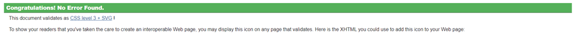
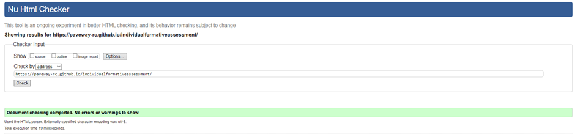
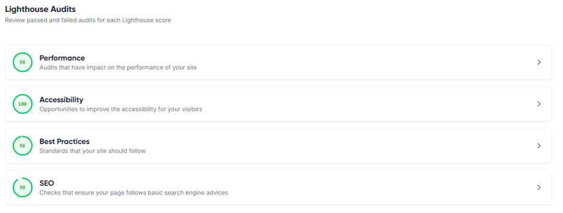

# Prevent

## Introduction 
This is a website made for my first Individual Flagstone Project, covering the British Government’s Prevent programme – an initiative to counter radicalisation and indoctrination into extremist and terrorist causes. This site contains information on Prevent, the hows and whys of radicalisation, as well as ways to seek help if they require it.

Here are the features of this site:
•	Homepage – an overview of what the site is about and links to other pages
•	Information on the Prevent programme
•	Signs of radicalisation, and the reasons why someone might fall into it
•	Links to further resources for those who wish to seek help or otherwise learn more

## Design considerations
The site was created in VS Code, with additional assistance from Github Copilot, especially for a lot of the Bootstrap side of things – an area which I admittedly do struggle with.
I decided to keep the site’s layout incredibly basic, with the main aim of just delivering information front and centre – the idea being that a visitor might need information then and there without any faffing about. I decided against adding images, as I felt that it might go against the tone of the information being presented and could potentially come across as being inappropriate – with a heavy topic such as this, I felt that avoiding trivialising it was a priority. Even when images were on the table, I decided against using AI-generated imagery, both for the reason above and also out of personal ethics concerns.
Navigation is done using the navbar at the top. The navbar is responsive to different screen sizes and will present as a dropdown on devices such as mobiles or windowed web browsers.
I decided to keep the site’s colour scheme relatively basic, using a simple white background with black text to ensure good readability. To prevent screen glare, I did ensure to dim the background from #FFFFFF (the default background colour) to #E6E6E6 (a dimmed/anti-flash white) to ensure that the site was easier on the viewer’s eyes.
I also included a video player, but it is currently non-functional for reasons I have been unable to figure out. It wasn’t really a priority, and I have included a direct link to it. It will be fixed in a later version.
I did also want to include a dark mode, however due to problems with implementation I decided that it wasn’t a required part of the MVP, so it has been left out.

CSS Validator

HTML Validator
 
Lighthouse score
  
## Credits
A number of sites were used in my research for this project – here they are below.
NSPCC
Gov.uk
Educate Against Hate
ACT
Education and Training Foundation

A further thank you goes out to the Code Institute, as well as other places in past careers regarding training/awareness of Prevent, from which some of this information has been gleamed from.

A further thank you to my peers for their interest in the project, as well as their assistance and advice throughout it’s assembly.

A big thank you to Ben for getting me away from the absolute [REDACTED] nightmare that is Gitpod.

## Things to add in future
I do want to try and come back to this at some point – the main focus here was the minimum viable product, so some things didn’t make the cut.

- Favicons: won’t lie, I kind of forgot about these
- Fix that video embed in the Information section
- Bit more work on the home page
- Maybe a bit more in the contacts as well – feels a little off
- Tinker about with the font maybe. It uses the default Bootstrap font and could maybe use something else.
- Try to include some images? Again not a big thing if they’re missed.
- Maybe replace Bootstrap with something else
- Dark mode
